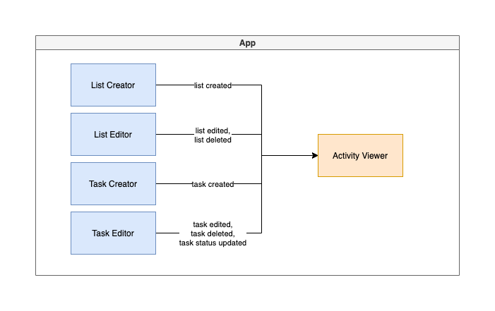

# Hello Trello

"Hello Trello" is the "hello world" version of the popular task-management app, Trello. It simplifies Trello's functionality to its most minimal essentials: creating tasks and moving them between lists.

## Architecture Description

A minimalist Trello clone.

### Users

Expected users are anyone who needs to plan projects or activities.

### Requirements

- Lists (columns) can be created and labeled
- Tasks (cards) can be created and editted
- Tasks can be moved between lists
- Optional: persistence

### Additional context

Tech stack will be react, redux, tailwind (theming, not the component library), and react hook form (forms).

### Architecture characteristics

Architecture characterists are the "-ilities" particular to an application that can or should influence the overall application architecture. For "Hello Trello", with such a large potential addressable market, one such characteristic is **scalability**. With that in mind, a monolithic, layered architecture style with presentation, actions, reducers, etc. layers, the most common approach to building apps, is less suitable for Hello-Trello. Without modularity, scaling will only be only possible up to a certain point. Accordingly, effort will be made to set-up a decoupled front-end architure to make it possible to eventually deliver as micro-frontends if necessary.

### Modules

To discover the core domains or modules of the application I followed a "workflow approach" where key role(s) and their activies are identified, and modules are then planned around these activities. For "Hello Trello" the key roles and [activities demonstrated](https://www.youtube.com/watch?v=AyfupeWS0yY) are:

1. Activity manager: Makes lists of tasks that can be editted and deleted.
2. Activity agent: Views lists and tasks and marks tasks as done, in progress, completed or cancelled.

Accordingly, this initial set of front-end modules are envisioned:

- List creator
- List editor
- Task creator
- Activity viewer
- Task editor

These modules should accordinly accomodate the following events:

- List created
- List deleted
- List edited
- Task created
- Task deleted
- Task edited
- Task status updated

## Stories

To help divide and organize the work, here are the user stories I extratec from the "workflow" analysis:

- [ ] As an activity manager I want to create lists for eventualy tasks.
- [ ] As an activity manager I want to edit or delete created lists.
- [ ] As an activity manager I want to create tasks and assign them to a list.
- [ ] As an activity manager I want to edit or delete a task.
- [ ] As an activity agent I want to see all lists and tasks' progress.
- [ ] As an activity agent I want to update the status of a task.

## Improvements

## Getting started

## Preview
