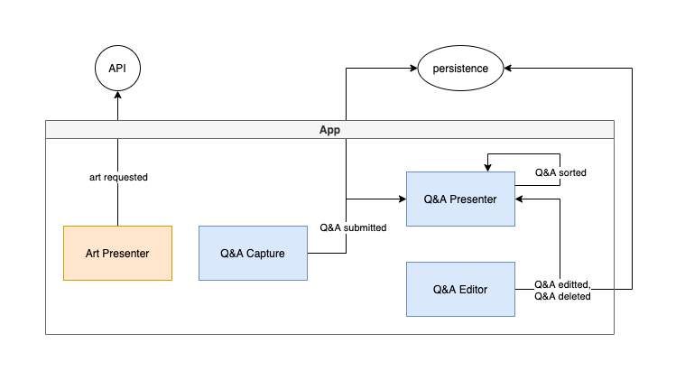
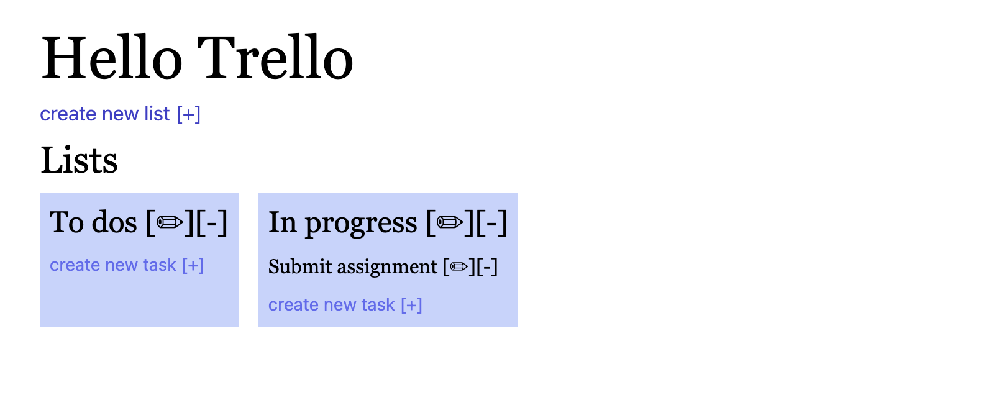

# Ask the Met

Visiting the Metropolitan Museum or Art in New York is not always feasible, even when there isn't a pandemic on. This shouldn't prevent us from appreciating and learning about the Met's collection though. With this simple app you can view a random piece or art, and create a list of questions and answers about it to review later.

## Architecture Description

An art-oriented question and answer app.

### Users

Users are students of art history, and are expected to be a handful per day.

### Requirements

- An example question and answer is shown by default
- Previously created questions and answers should be listed, and the answer only revealed on click.
- Questions should be persisted
- Questions can be sortable for convenience
- Questions can be deleted
- Questions can be edited
- How to use the app should be communicated through tooltips
- Optional: tests

### Additional context

Tech stack must include react and redux. The supplementary stack is tailwind (theming), react hook form (forms).

### Architecture characteristics

Architecture characterists are the "-ilities" particular to an application that can or should influence the overall application architecture. In the case of "Ask the Met", one such characteristic might be **resilience**. If the internet becomes unavailable, as a ~~user~~ art-lover, I wanted my questions and answers to be saved. Accordingly, offline caching was explored and localstorage was used to persist Q&As. If the art-lover refreshes the page the QAs are rehydrated from localstorage for instance. After successful caching in localstorage the next step would be to upload the Q&As to the db. The Q&As are less likely to be lost this way.

### Modules

To discover the core modules of the application I tried an "event storming" approach where I assumed events were used to communicate within and without the application (an approach that conforms well to a standard redux app). Then events were grouped and used to derive the modules. For the ~~user~~ art-lover, the following core events were envisioned:

- Art requested
- Q&A submitted
- Q&A editted
- Q&A deleted
- Q&A sorted

Based on these events, the following set of modules were derived:

- Art presenter module ("Art requested")
- Q&A capture module ("Q&A submitted")
- Q&A editor module (Q&A editted, "Q&A deleted")
- Q&A presenter module ("Q&A sorted")

## Stories

To help divide and organize the work, I created "user stories":

- [x] As an art-lover I want to formulate a question and answer about a piece and save it.
- [x] As an art-lover I want to get a new, random art piece and see basic information about it.
- [x] As an art-lover I only want to see the answers on click.
- [x] As an art-lover I want to be able to edit or delete questions and answers I previously submitted.
- [x] As an art-lover I want to organize my questions alphabetically.
- [x] As an art-lover I want to understand how to use the app (through tooltips).

## Improvements

Like a work of art, an application is never done, we only stop working on it. Here's what I would like to do additionally:

- Improve unit test coverage, ideally any component or util that contains logic is covered by a unit test
- Add e2e test coverage, ideally the core user flows of the application are covered by an e2e test
- Extract common components to a component library, e.g. primary and secondary buttons
- Introduce ramda and use it for data transformation
- Add animation and/or transitions for a more natural feeling UI/UX
- Replace direct localstorage calls with [Redux Persist](https://www.npmjs.com/package/redux-persist)
- Persist QAs to a database
- Handle error cases and introduce monitoring, e.g. Sentry

## Getting started

- `git clone git@github.com:melaniebrgr/ask-the-met.git`
- `cd ask-the-met`
- `yarn install` (node >=12.13.0)
- `yarn start`

## Preview

